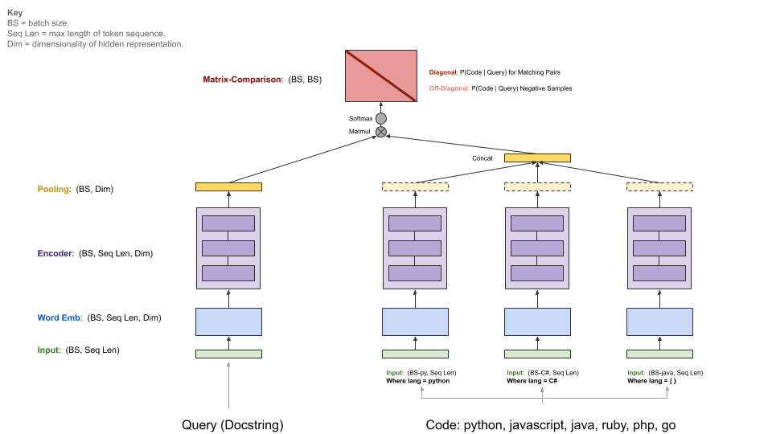

 [](https://opensource.org/licenses/MIT)  [](https://www.python.org/downloads/release/python-360/)
[](https://app.wandb.ai/github/codesearchnet/benchmark)

**TODO: Update Paper Link **

[paper]: https://ml4code.github.io/

**Table of Contents**

<!-- TOC depthFrom:1 depthTo:6 withLinks:1 updateOnSave:1 orderedList:0 -->

- [Introduction](#introduction)
	- [Project Overview](#project-overview)
	- [Data](#data)
	- [Evaluation](#evaluation)
		- [Annotations](#annotations)
	- [Setup](#setup)
- [Data Details](#data-details)
	- [Data Acquisition](#data-acquisition)
	- [Schema & Format](#schema-format)
	- [Downloading Data from S3](#downloading-data-from-s3)
- [Running our Baseline Model](#running-our-baseline-model)
	- [Quickstart](#quickstart)
	- [Model Architecture](#model-architecture)
	- [Training](#training)
- [References](#references)
	- [Benchmark](#benchmark)
	- [How to Contribute](#how-to-contribute)
	- [Other READMEs](#other-readmes)
	- [W&B Setup](#wb-setup)
	- [Licenses](#licenses)

<!-- /TOC -->

# QuickStart: Training Baseline Models

Want to jump right into training our baseline model?  Head [here](#quickstart).

# Introduction

## Project Overview

  [CodeSearchNet][paper] is a collection of datasets and benchmarks that explore the problem of code retrieval using natural language.  This research is a continuation of some ideas presented in this [blog post](https://githubengineering.com/towards-natural-language-semantic-code-search/) and is a joint collaboration between GitHub and the [Deep Program Understanding](https://www.microsoft.com/en-us/research/project/program/) group at [Microsoft Research - Cambridge](https://www.microsoft.com/en-us/research/lab/microsoft-research-cambridge/).  Our intent is to present and provide a platform for this research to the community by providing the following:

  1. Instructions for obtaining large corpora of relevant data
  2. Open source code for a range of baseline models, along with pre-trained weights
  3. Baseline evaluation metrics and utilities.
  4. Mechanisms to track progress on a [shared community benchmark](https://app.wandb.ai/github/codesearchnet/benchmark), hosted by [Weights & Biases](https://www.wandb.com/)

We hope that CodeSearchNet is a step towards engaging with the broader machine learning and NLP community regarding the relationship between source code and natural language. We describe a specific task here, but we expect and welcome other uses of our dataset.

More context regarding the motivation for this problem is in [this paper][paper].

## Data

  The primary dataset consists of 2 Million (`comment`, `code`) pairs from open source libraries.  Concretely, a `comment` is a top-level function or method comment (e.g. [docstrings](https://en.wikipedia.org/wiki/Docstring) in Python), and `code` is an entire function or method. Currently, the dataset contains Python, Javascript, Ruby, Go, Java, and PHP code.  Throughout this repo, we refer to the terms docstring and query interchangeably.  We partition the data into train, validation, and test splits such that code from the same repository can only exist in one partition. Currently this is the only dataset on which we train our model. Summary stastics about this dataset can be found in [this notebook](notebooks/ExploreData.ipynb)

  For more information about how to obtain the data, see [this section](#data-details).

## Evaluation

  The metric we use for evaluation is [Normalized Discounted Cumalitive Gain](https://en.wikipedia.org/wiki/Discounted_cumulative_gain#Normalized_DCG).  Please reference [this paper][paper] for further details regarding model evaluation.

### Annotations

  We manually annotated retrieval results for the six languages from 99 general [queries](resources/queries.csv). This dataset is used as groundtruth data for evaluation _only_. Please reference [this paper][paper] for further details on the annotation process.


## Setup

  You should only have to perform the setup steps once to download the data and prepare the environment.

  1. Due to the complexity of installing all dependencies, we prepared Docker containers to run this code. You can find instructions on how to install Docker in the [official docs](https://docs.docker.com/get-started/).  Additionally, you must install [Nvidia-Docker](https://github.com/NVIDIA/nvidia-docker) to satisfy GPU-compute related dependencies.  For those who are new to Docker, this [blog post](https://towardsdatascience.com/how-docker-can-help-you-become-a-more-effective-data-scientist-7fc048ef91d5) provides a gentle introduction focused on data science.

  2. After installing Docker, you need to download the pre-processed datasets, which are hosted on S3.  You can do this by running `script/setup`.
      ```
      script/setup
      ```
      This will build Docker containers and download the datasets.  By default, the data is downloaded into the `resources/data/` folder inside this repository, with the directory structure described [here](resources/README.md).

  **The datasets you will download (most of them compressed) have a combined size of only ~ 3.5 GB.** 

  For more about the data, see [Data Details](#data-details) below as well as [this notebook](notebooks/ExploreData.ipynb).


# Data Details

## Data Acquisition

If you have run the [setup steps](#setup) above you will already have the data, and nothing more needs to be done. The data will be available in the `/resources/data` folder of this repository, with [this directory structure](/resources/README.md).

## Schema & Format

Data is stored in [jsonlines](http://jsonlines.org/) format.  Each line in the uncompressed file represents one example (usually a function with an associated comment). A prettified example of one row is illustrated below.

- **repo:** the owner/repo
- **path:** the full path to the original file
- **func_name:** the function or method name
- **original_string:** the raw string before tokenization or parsing
- **language:** the programming language
- **code:** the part of the `original_string` that is code
- **code_tokens:** tokenized version of `code`
- **docstring:** the top level comment or docstring, if exists in the original string
- **docstring_tokens:** tokenized version of `docstring`
- **sha:** this field is not being used [TODO: add note on where this comes from?]
- **partition:** a flag indicating what partition this datum belongs to of {train, valid, test, etc.} This is not used by the model.  Instead we rely on directory structure to denote the partition of the data.
- **url:** the url for the this code snippet including the line numbers

Code, comments, and docstrings are extracted in a language-specific manner, removing artifacts of that language.

```{json}
{
  'code': 'def get_vid_from_url(url):\n'
          '        """Extracts video ID from URL.\n'
          '        """\n'
          "        return match1(url, r'youtu\\.be/([^?/]+)') or \\\n"
          "          match1(url, r'youtube\\.com/embed/([^/?]+)') or \\\n"
          "          match1(url, r'youtube\\.com/v/([^/?]+)') or \\\n"
          "          match1(url, r'youtube\\.com/watch/([^/?]+)') or \\\n"
          "          parse_query_param(url, 'v') or \\\n"
          "          parse_query_param(parse_query_param(url, 'u'), 'v')",
  'code_tokens': ['def',
                  'get_vid_from_url',
                  '(',
                  'url',
                  ')',
                  ':',
                  'return',
                  'match1',
                  '(',
                  'url',
                  ',',
                  "r'youtu\\.be/([^?/]+)'",
                  ')',
                  'or',
                  'match1',
                  '(',
                  'url',
                  ',',
                  "r'youtube\\.com/embed/([^/?]+)'",
                  ')',
                  'or',
                  'match1',
                  '(',
                  'url',
                  ',',
                  "r'youtube\\.com/v/([^/?]+)'",
                  ')',
                  'or',
                  'match1',
                  '(',
                  'url',
                  ',',
                  "r'youtube\\.com/watch/([^/?]+)'",
                  ')',
                  'or',
                  'parse_query_param',
                  '(',
                  'url',
                  ',',
                  "'v'",
                  ')',
                  'or',
                  'parse_query_param',
                  '(',
                  'parse_query_param',
                  '(',
                  'url',
                  ',',
                  "'u'",
                  ')',
                  ',',
                  "'v'",
                  ')'],
  'docstring': 'Extracts video ID from URL.',
  'docstring_tokens': ['Extracts', 'video', 'ID', 'from', 'URL', '.'],
  'func_name': 'YouTube.get_vid_from_url',
  'language': 'python',
  'original_string': 'def get_vid_from_url(url):\n'
                      '        """Extracts video ID from URL.\n'
                      '        """\n'
                      "        return match1(url, r'youtu\\.be/([^?/]+)') or \\\n"
                      "          match1(url, r'youtube\\.com/embed/([^/?]+)') or "
                      '\\\n'
                      "          match1(url, r'youtube\\.com/v/([^/?]+)') or \\\n"
                      "          match1(url, r'youtube\\.com/watch/([^/?]+)') or "
                      '\\\n'
                      "          parse_query_param(url, 'v') or \\\n"
                      "          parse_query_param(parse_query_param(url, 'u'), "
                      "'v')",
  'partition': 'test',
  'path': 'src/you_get/extractors/youtube.py',
  'repo': 'soimort/you-get',
  'sha': 'b746ac01c9f39de94cac2d56f665285b0523b974',
  'url': 'https://github.com/soimort/you-get/blob/b746ac01c9f39de94cac2d56f665285b0523b974/src/you_get/extractors/youtube.py#L135-L143'
}
```

Furthermore, summary statistics such as row counts and token length histograms can be found in [this notebook](notebooks/ExploreData.ipynb)

## Downloading Data from S3

The shell script `/script/setup` will automatically download these files into the `/resources/data` directory.  Here are the links to the relevant files for visibility:

The s3 links follow this pattern:

> https://s3.amazonaws.com/code-search-net/CodeSearchNet/v2/{python,java,go,php,javascript,ruby}.zip

For example, the link for the `java` is:

> https://s3.amazonaws.com/code-search-net/CodeSearchNet/v2/java.zip

The size of the dataset is approximately 20 GB.  The various files and the directory structure are explained [here](resources/README.md).


# Running our Baseline Model

Warning: the scripts provided to reproduce our baseline model take more than 24 hours on an [AWS P3-V100](https://aws.amazon.com/ec2/instance-types/p3/) instance.

## Quickstart

Make sure you have [Docker](https://docs.docker.com/get-started/) and [Nvidia-Docker](https://github.com/NVIDIA/nvidia-docker) (for GPU-compute related dependencies) installed. You should only have to perform the setup steps once to prepare the environment and download the data.

  ```bash
  # clone this repository
  git clone https://github.com/ml-msr-github/CodeSearchNet.git
  # download data (~3.5GB) from S3; build and run Docker container
  # (this will land you inside the Docker container, starting in the /src directory--you can detach from/attach to this container to pause/continue your work)
  cd CodeSearchNet/
  script/setup
  # optional: log in to W&B to see your training metrics, track your experiments, and submit your models to the community benchmark
  wandb login
  # verify your setup by training a tiny model
  python train.py --testrun
  # see other command line options, try a full training run, and explore other model variants by extending this baseline training script example
  python train.py --help
  python train.py
  ```

Once you're satisfied with a new model, test it against the CodeSearchNet Challenge. This will generate a CSV file of model prediction scores which you can then submit to the Weights & Biases [community benchmark](https://app.wandb.ai/github/codesearchnet/benchmark) by [following these instructions](src/docs/BENCHMARK.md).

  ```bash
  python predict.py [-r | --wandb_run_id] github/codesearchnet/0123456
  # or
  python predict.py [-m | --model_file] ../resources/saved_models/*.pkl.gz
  ```

## Model Architecture

  Our baseline models ingest a parallel corpus of (`comments`, `code`) and learn to retrieve a code snippet given a natural language query.  Specifically, `comments` are top-level function and method comments (e.g. docstrings in Python), and `code` is an entire function or method. Throughout this repo, we refer to the terms docstring and query interchangeably.

  The query has a single encoder, whereas each programming language has its own encoder. The available encoders are Neural-Bag-Of-Words, RNN, 1D-CNN, Self-Attention (BERT), and a 1D-CNN+Self-Attention Hybrid.

  The diagram below illustrates the general architecture of our baseline models:
  
  

## Training

This step assumes that you have a suitable Nvidia-GPU with [Cuda v9.0](https://developer.nvidia.com/cuda-90-download-archive) installed.  We used [AWS P3-V100](https://aws.amazon.com/ec2/instance-types/p3/) instances (a `p3.2xlarge` is sufficient).

  1. Start the model run environment by running `script/console`:
      ```
      script/console
      ```
      This will drop you into the shell of a Docker container with all necessary dependencies installed, including the code in this repository, along with data that you downloaded in the previous step.  By default you will be placed in the `src/` folder of this GitHub repository.  From here you can execute commands to run the model.

  2. Set up [W&B](https://docs.wandb.com/docs/started.html) (free for open source projects) per the instructions below if you would like to share your results on the community benchmark.  This is optional but highly recommended.

  3. The entry point to this model is `src/train.py`.  You can see various options by executing the following command:
      ```
      python train.py --help
      ```
      To test if everything is working on a small dataset, you can run the following command:
      ```
      python train.py --testrun
      ```

  4. Now you are prepared for a full training run.  Example commands to kick off training runs:
  * Training a neural-bag-of-words model on all languages
      ```
      python train.py --model neuralbow
      ```

    The above command will assume default values for the location(s) of the training data and a destination where would like to save the output model.  The default location for training data is specified in `/src/data_dirs_{train,valid,test}.txt`.  These files each contain a list of paths where data for the corresponding partition exists. If more than one path specified (separated by a newline), the data from all the paths will be concatenated together.  For example, this is the content of `src/data_dirs_train.txt`:

    ```
    $ cat data_dirs_train.txt
    ../resources/data/python/final/jsonl/train
    ../resources/data/javascript/final/jsonl/train
    ../resources/data/java/final/jsonl/train
    ../resources/data/php/final/jsonl/train
    ../resources/data/ruby/final/jsonl/train
    ../resources/data/go/final/jsonl/train
    ```

    By default models are saved in the `resources/saved_models` folder of this repository.

  * Training a 1D-CNN model on Python data only:
    ```
    python train.py --model 1dcnn /trained_models ../resources/data/python/final/jsonl/train ../resources/data/python/final/jsonl/valid ../resources/data/python/final/jsonl/test
    ```

    The above command overrides the default locations for saving the model to `trained_models` and also overrides the source of the train, validation, and test sets.

Additional notes:
* Options for `--model` are currently listed in `src/model_restore_helper.get_model_class_from_name`.

* Hyperparameters are specific to the respective model/encoder classes; a simple trick to discover them is to kick off a run without specifying hyperparameter choices, as that will print a list of all used hyperparameters with their default values (in JSON format).

* By default, models are saved in the `/resources/saved_models` folder of this repository, but this can be overridden as shown above.


# References

## Benchmark

  We are using a community benchmark for this project to encourage collaboration and improve reproducibility.  It is hosted by [Weights & Biases](https://www.wandb.com/) (W&B), which is free for open source projects.  Our entries in the benchmark link to detailed logs of our training and evaluation metrics, as well as model artifacts, and we encourage other participants to provide as much transparency as possible.

  We invite the community to submit their runs to this benchmark to facilitate transperency by following [these instructions](src/docs/BENCHMARK.md).

## How to Contribute
  
  We anticipate that the community will design custom architectures and use frameworks other than Tensorflow.  Furthermore, we anticipate that additional datasets will be useful.  It is not our intention to integrate these models, approaches, and datasets into this repository as a superset of all available ideas.  Rather, we intend to maintain the baseline models and links to the data in this repository as a central place of reference.  We are accepting PRs that update the documentation, link to your project(s) with improved benchmarks, fix bugs, or make minor improvements to the code.  Here are [more specific guidelines for contributing to this repository](CONTRIBUTING.md); note particularly our [Code of Conduct](CODE_OF_CONDUCT.md).  Please open an issue if you are unsure of the best course of action.  

## Other READMEs

- [Submitting to the benchmark](BENCHMARK.md)
- [Data structure](/resources/README.md)

## W&B Setup

 To initialize W&B:

   1. Navigate to the `/src` directory in this repository.

   2. If it's your first time using W&B on a machine, you will need to login:

      ```
      $ wandb login
      ```

   3. You will be asked for your API key, which appears on your [W&B profile settings page](https://app.wandb.ai/settings).

## Licenses

The licenses for source code used as data for this project are provided with the [data download](#downloading-data-from-s3) for each language in `_licenses.pkl` [files](resources/README.md#directory-structure).

This code and documentation for this project are released under the [MIT License](LICENSE).
